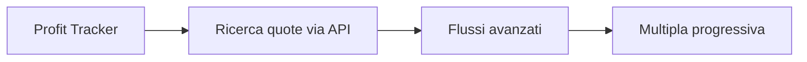

# Profit Tracker — Product Case Study

> Un progetto personale raccontato dal punto di vista dell'analisi funzionale.

Profit Tracker nasce da un'esigenza concreta: sostituire fogli Excel con macro, efficaci ma poco utilizzabili da smartphone, con un unico punto di controllo mobile-first per operazioni, promozioni, saldi, movimenti e risultati.

Questo repository contiene **solo documentazione di prodotto**. Non contiene il codice sorgente dell'applicazione, URL di ambienti, configurazioni, credenziali o dati reali.

## Il problema

Le informazioni necessarie erano distribuite tra più fogli, controlli manuali e promemoria. Il calcolo non era il limite principale: lo erano accessibilità, coerenza del dato e capacità di capire rapidamente cosa richiedesse attenzione.

## L'obiettivo

Progettare uno strumento che permetta di:

- registrare e classificare operazioni singole, multiple e attività casino;
- monitorare promozioni, scadenze e attività da completare;
- riconciliare saldi, depositi e prelievi;
- analizzare risultati mensili e andamento complessivo;
- lavorare prima di tutto da smartphone.

## Il mio contributo

Il progetto è affrontato con il metodo dell'Analista Funzionale:

1. ricostruzione del processo reale e dei punti di attrito;
2. definizione di requisiti, casi d'uso e regole;
3. modellazione di entità, stati e relazioni;
4. prioritizzazione tra MVP, evolutive e dipendenze;
5. verifica dei flussi, degli edge case e dei criteri di accettazione;
6. valutazione delle dipendenze esterne, inclusi provider API, costi, limiti di utilizzo e rischio di vendor lock-in;
7. validazione con utenti diversi dall'analista attraverso feedback e UAT su scenari reali.

## Validazione con utenti

Nelle prime fasi del progetto l'analista coincide con l'utente. Questa conoscenza diretta accelera la comprensione del problema, ma può anche confermare assunzioni non generalizzabili. Il passo successivo prevede il coinvolgimento di un piccolo gruppo di utilizzatori che conoscono il processo, la raccolta strutturata dei feedback e una fase di User Acceptance Testing su scenari reali.

## Mappa del case study

| Documento | Contenuto |
| --- | --- |
| [Product vision](docs/product-vision.md) | Problema, utenti, obiettivi e principi |
| [Perimetro MVP](docs/mvp-scope.md) | Funzioni incluse, escluse e priorità |
| [Requisiti funzionali](docs/functional-requirements.md) | Epic, requisiti e criteri di accettazione |
| [User flow](docs/user-flows.md) | Flussi principali e gestione delle eccezioni |
| [Modello funzionale](docs/data-model.md) | Entità, relazioni e stati principali |
| [Roadmap](docs/roadmap.md) | Evoluzione dal controllo del dato all'automazione e strategia API |
| [Strategia di test](docs/test-strategy.md) | Scenari, rischi, UAT ed exit criteria |
| [Decision log](docs/decision-log.md) | Decisioni di prodotto, valutazione provider e alternative scartate |
| [Glossario](docs/glossary.md) | Terminologia essenziale |
| [Presentazione del case study](assets/profit-tracker-case-study.pdf) | Sintesi visuale in 8 slide |

## Roadmap sintetica

La fase di integrazione con quote esterne è stata impostata per rimanere indipendente dal singolo provider. Lo scouting ha già incluso soluzioni specializzate come OpticOdds, valutate rispetto a copertura, qualità del dato, limiti di chiamata, costo e sostenibilità per il volume d'uso previsto.

## Nota sul matched betting

Il matched betting non si basa sulla previsione del risultato sportivo: combina operazioni su esiti opposti per determinare matematicamente il risultato economico quando configurazione ed esecuzione sono corrette. Rimangono rilevanti condizioni promozionali, variazioni delle quote ed errori operativi.

Questo repository non propone scommesse, strategie commerciali o promesse di guadagno. Documenta esclusivamente un esercizio personale di analisi e progettazione di prodotto.

---

**Michael Palmas — Functional Analyst**

_English summary: a public, documentation-only case study showing how a real mobile-first need was translated into product vision, functional requirements, user flows, data model, testing strategy, API/vendor evaluation and roadmap. Application source code and live environments remain private._
