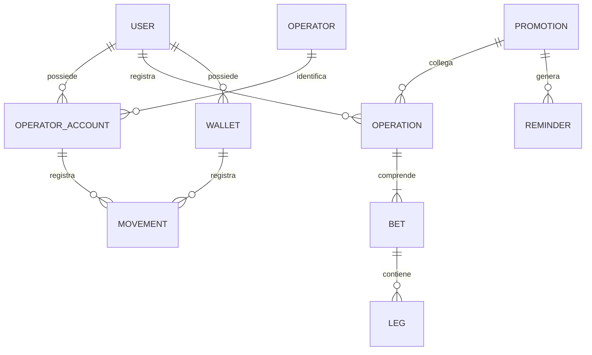
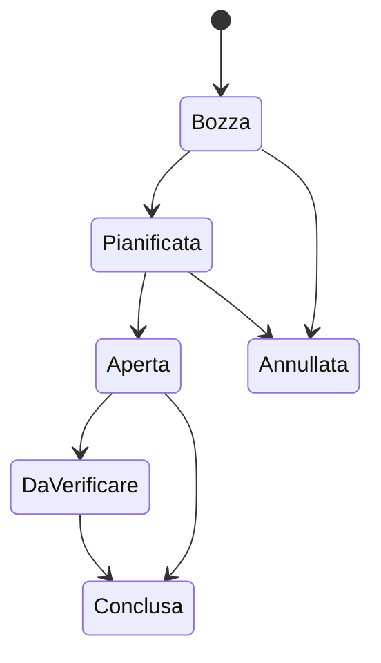

# Modello funzionale dei dati

Il diagramma descrive le responsabilità delle principali entità, non lo schema fisico del database.

## Entità principali

| Entità | Responsabilità |
| --- | --- |
| User | proprietario dei dati e delle configurazioni |
| Operator | anagrafica del bookmaker, exchange o altro operatore |
| Operator Account | conto effettivamente utilizzato dall'utente |
| Operation | contenitore funzionale dell'attività e del risultato |
| Bet | singola componente economica dell'operazione |
| Leg | evento o selezione appartenente a una multipla |
| Promotion | bonus, iniziativa e condizioni da monitorare |
| Wallet | strumento di pagamento o conto esterno |
| Movement | deposito, prelievo, trasferimento o rettifica |
| Reminder | scadenza o attività collegata a una promozione |

## Stati di Operation

## Regole di modellazione

- Operator e Operator Account restano separati.
- Operation aggrega il processo; Bet rappresenta la singola componente.
- I movimenti finanziari non vengono confusi con il risultato economico.
- Gli stati devono rendere esplicita l'incertezza operativa.
- Le informazioni calcolate devono essere ricostruibili dai dati sorgente.
