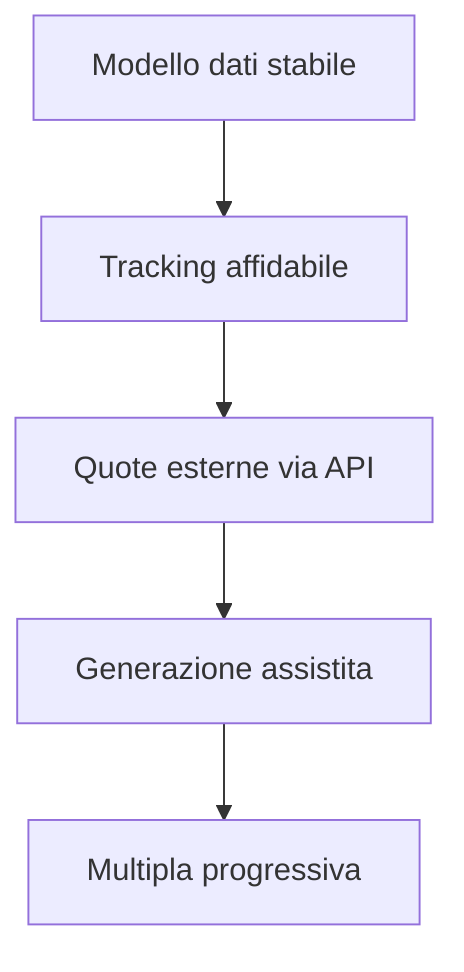

# Roadmap di prodotto

## Principio

L'evoluzione procede dalla qualità del dato verso l'automazione. Ogni fase dipende dalla stabilità di quella precedente.

## Fase 1 — Profit Tracker

**Obiettivo:** creare la fonte dati unica.

- tracking di singole, multiple e casino;
- promozioni, memo e scadenze;
- saldi, movimenti e riconciliazioni;
- import iniziale;
- dashboard e report mensili.

## Fase 2 — Ricerca quote

**Obiettivo:** ridurre la ricerca manuale delle opportunità tramite integrazione con fonti quote esterne.

- oddsmatcher on demand;
- confronto delle opportunità;
- filtri per mercato e tipologia;
- integrazione API tramite un adapter sostituibile, indipendente dal provider;
- controllo del consumo delle chiamate e dei costi associati;
- selezione del provider in base a copertura, qualità del dato, limiti di utilizzo e sostenibilità economica.

### Strategia dati esterni

La fase di scouting dei provider è già stata avviata. Tra le soluzioni valutate rientra OpticOdds, analizzato rispetto a copertura, mercati disponibili, limiti di richiesta e costo. Per il volume iniziale previsto, limitato a pochi utenti, non è stata ancora fissata una dipendenza definitiva: la scelta finale verrà effettuata solo quando l'uso reale dell'oddsmatcher renderà misurabili frequenza delle chiamate, copertura necessaria e costo per utilizzo.

L'obiettivo architetturale è evitare vendor lock-in: il Profit Tracker deve poter cambiare fonte quote senza modificare il proprio modello funzionale.

## Fase 3 — Flussi avanzati

**Obiettivo:** collegare ricerca, configurazione e tracking.

- generazione assistita di singole e multiple;
- flussi punta-banca e punta-punta;
- gestione del lock delle bancate;
- sincronizzazione con il Profit Tracker;
- refresh controllato della sessione.

## Fase 4 — Multipla progressiva

**Obiettivo:** gestire end-to-end un processo composto da più eventi e decisioni successive.

- configurazione della progressione;
- monitoraggio di ogni step;
- ricalcolo delle azioni successive;
- gestione di interruzioni ed eccezioni;
- tracciamento unitario del risultato finale.

## Dipendenze

## Criterio di avanzamento

Una fase può essere considerata pronta quando i flussi principali sono verificati, le eccezioni critiche sono gestite e il risultato rimane riconciliabile.
