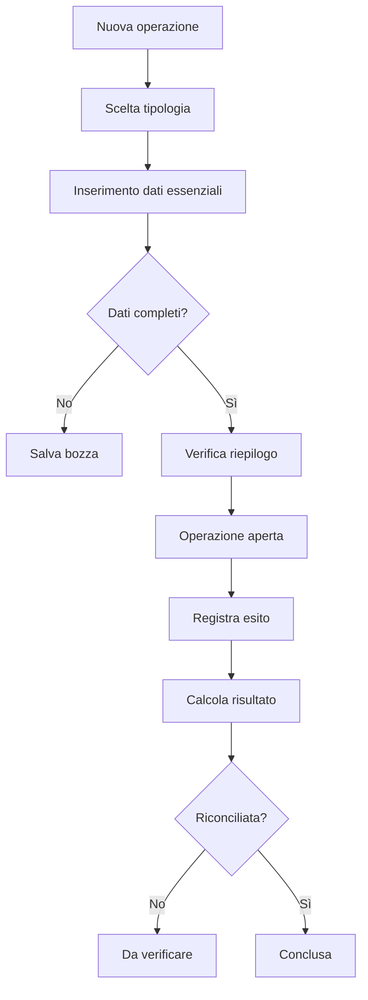
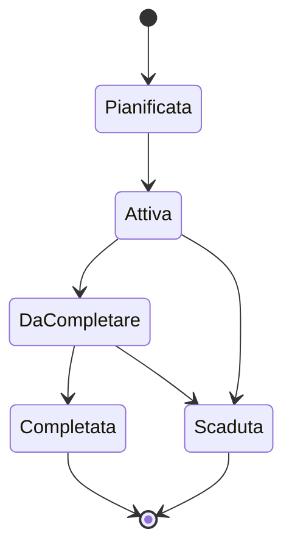
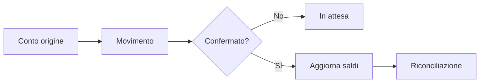

# User flow

## Flusso principale: registrare e chiudere un'operazione

## Flusso: promozione e scadenza

## Flusso: deposito e prelievo

## Eccezioni da gestire

- operazione salvata senza tutti i dati;
- quota o importo modificati dopo la pianificazione;
- evento rinviato o annullato;
- movimento finanziario ancora in attesa;
- differenza tra saldo atteso e saldo dichiarato;
- promozione scaduta con attività non completate;
- modifica retroattiva che cambia il mese di competenza.
